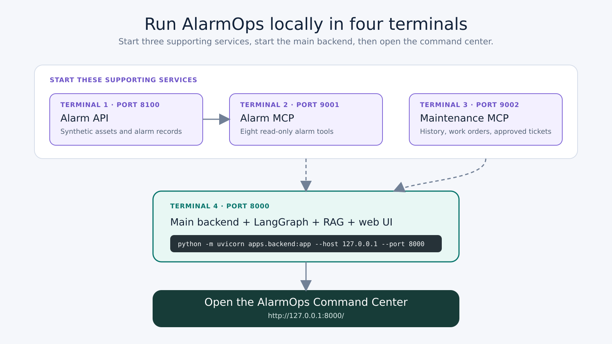
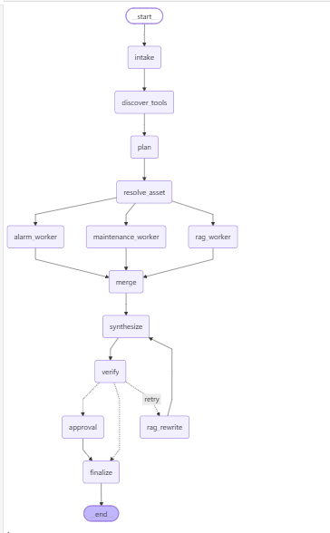

# AlarmOps Agentic Command Center

## Objective

Industrial plants produce many alarms every day. Alarm details, asset information, maintenance history, and operating procedures often sit in different systems. An operator or reliability engineer must open several applications before reaching a useful conclusion.

This code brings that information into one investigation flow.

A natural-language question starts a LangGraph workflow. The workflow finds the asset, collects alarm and maintenance evidence through MCP servers, searches local procedure documents, and asks a language model to write a grounded summary. A ticket can be created only after human approval.

The application is decision support. No tool can start, stop, trip, isolate, suppress, or acknowledge plant equipment.

Main goals:

- reduce time spent collecting evidence;
- keep alarm, maintenance, and document evidence visible;
- separate facts from possible causes;
- show every graph step;
- block ticket creation until human approval;
- store local traces and tickets for review.

This repository is for local execution. Docker, notebooks, cloud deployment files, test reports, and generated database files are intentionally excluded.

## Main features

- LangGraph plan-and-execute workflow
- two MCP servers with 12 discovered tools
- three parallel evidence workers
- local BM25 and MiniLM RAG search
- Groq `openai/gpt-oss-120b` answer generation
- deterministic mode for testing without an LLM call
- evidence ledger and citation checks
- human approval before ticket creation
- SQLite ticket and telemetry storage
- failure demonstrations for missing services or documents
- simple browser interface

## How to run

### The main application would run at http://127.0.0.1:8000 . But this requires setting up other applications(alarm api/mcp servers as well)

### 1. Requirements

- Windows PowerShell
- Python 3.12 or 3.13
- Git
- internet access during the first MiniLM model download
- Groq API key for real LLM answers

No Hugging Face API key is required. MiniLM runs locally.

### 2. Clone the repository

```powershell
git clone <repository-url>
cd alarmops-agentic-command-center
```

### 3. Create the Python environment

```powershell
python -m venv .venv
Set-ExecutionPolicy -Scope Process -ExecutionPolicy RemoteSigned
.\.venv\Scripts\Activate.ps1
python -m pip install --upgrade pip
python -m pip install -e .
```

`pyproject.toml` contains all runtime dependencies. A separate `requirements.txt` file is not required.

### 4. Create the environment file

```powershell
Copy-Item .env.example .env
```

Open `.env` and add the Groq key:

```env
LLM_API_KEY=replace-with-groq-key
LLM_API_BASE=https://api.groq.com/openai/v1
LLM_MODEL=openai/gpt-oss-120b
LLM_MODE=groq
```

Keep `.env` local. `.gitignore` blocks the file from Git.

### 5. Start the Alarm API

Open PowerShell terminal 1 from the repository root:

```powershell
.\.venv\Scripts\Activate.ps1
python -m uvicorn apps.alarm_api:app --host 127.0.0.1 --port 8100
```

Check the API:

```powershell
Invoke-RestMethod "http://127.0.0.1:8100/health"
```

Expected service name:

```text
alarm-api
```

The Alarm API reads synthetic assets and alarms from `alarmops/data.py`.

### 6. Start the Alarm MCP server

Open PowerShell terminal 2 from the repository root:

```powershell
.\.venv\Scripts\Activate.ps1
$env:ALARM_API_BASE_URL="http://127.0.0.1:8100"
$env:MCP_PORT="9001"
python -m mcp_servers.alarm_server
```

The Alarm MCP server converts Alarm API operations into standard MCP tools. The LangGraph workflow can discover the tool name, description, input schema, and read/write type at runtime.

### 7. Start the Maintenance MCP server

Open PowerShell terminal 3 from the repository root:

```powershell
.\.venv\Scripts\Activate.ps1
$env:MCP_PORT="9002"
python -m mcp_servers.maintenance_server
```

The Maintenance MCP server provides maintenance history, open work orders, ticket drafting, and approval-gated ticket creation.

### 8. Start the main backend and web interface

Open PowerShell terminal 4 from the repository root:

```powershell
.\.venv\Scripts\Activate.ps1
$env:ALARM_MCP_URL="http://127.0.0.1:9001/mcp"
$env:MAINTENANCE_MCP_URL="http://127.0.0.1:9002/mcp"
python -m uvicorn apps.backend:app --host 127.0.0.1 --port 8000
```

The first backend start downloads `sentence-transformers/all-MiniLM-L6-v2`. Later starts use the local model cache.

Open:

```text
http://127.0.0.1:8000
```

### 9. Check all services

```powershell
Test-NetConnection 127.0.0.1 -Port 8100
Test-NetConnection 127.0.0.1 -Port 9001
Test-NetConnection 127.0.0.1 -Port 9002
Test-NetConnection 127.0.0.1 -Port 8000
```

Every result must show:

```text
TcpTestSucceeded : True
```

Check backend health:

```powershell
Invoke-RestMethod "http://127.0.0.1:8000/health" |
    ConvertTo-Json -Depth 10
```

Expected RAG information:

```text
documents: 4
chunks: 12
method: BM25 + Hugging Face MiniLM cosine
embedding_dimension: 384
embedding_api_required: false
```

Check MCP discovery:

```powershell
$tools = Invoke-RestMethod "http://127.0.0.1:8000/api/tools"
$tools | Select-Object server,name,write_operation | Format-Table -AutoSize
$tools.Count
```

Expected tool count:

```text
12
```

### 10. Run sample questions

Read-only investigation:

```text
Investigate recurring high and critical alarms for Boiler Feed Pump 101 over the last 90 days.
```

Evidence comparison:

```text
Why is Boiler Feed Pump 101 showing low discharge pressure? Use alarm, maintenance, and procedure evidence.
```

Ticket draft:

```text
Investigate Boiler Feed Pump 101 and draft an escalation ticket.
```

Human approval and ticket creation:

```text
Investigate Boiler Feed Pump 101 and create a ticket if escalation is justified.
```

Deterministic reviewer mode runs the complete graph without calling Groq. Clear the checkbox for a real model call.

A real model result shows:

```text
llm · groq · openai/gpt-oss-120b
```

A deterministic result shows:

```text
deterministic · local · built-in-reviewer
```

Created tickets are stored in:

```text
data/tickets.db
```

Graph runs, node spans, and approvals are stored in:

```text
data/telemetry.db
```

## Architecture

### LangGraph pattern



The workflow uses a plan-and-execute orchestrator with parallel workers, an evaluator, and human approval.

```text
Question
  ↓
Intake
  ↓
Discover MCP tools
  ↓
Plan
  ↓
Resolve asset
  ↓
Alarm worker ─┐
Maintenance worker ─┼─ run in parallel
RAG worker ───┘
  ↓
Merge evidence
  ↓
LLM synthesis
  ↓
Verify answer
  ├─ weak retrieval → one RAG rewrite
  ├─ read-only request → finalize
  └─ ticket request → human approval → create ticket → finalize
```

The graph is controlled rather than fully autonomous. Every main task, retry, and write boundary is visible in the graph.

### Graph nodes

| Node | Task |
|---|---|
| `intake` | Creates the run ID, records the question, and starts telemetry. |
| `discover_tools` | Connects to both MCP servers and loads the live tool catalog. |
| `plan` | Extracts asset text, lookback days, severity filters, and ticket intent. |
| `resolve_asset` | Calls Alarm MCP to map a name such as Boiler Feed Pump 101 to `AST-BFP-101`. |
| `alarm_worker` | Gets alarm chronology, summary, active count, critical count, and recurrence candidates. |
| `maintenance_worker` | Gets completed maintenance findings and open work orders. A ticket draft is prepared only when requested. |
| `rag_worker` | Searches trusted local Markdown procedures with BM25 and MiniLM. |
| `merge` | Creates one evidence ledger from MCP and RAG results. |
| `synthesize` | Sends the evidence bundle to Groq and creates findings, possible contributors, actions, caveats, citations, and confidence. |
| `verify` | Checks alarm evidence, citation IDs, citation resolution, and safety caveats. |
| `rag_rewrite` | Expands the retrieval query once when verification finds weak document evidence. |
| `approval` | Pauses the graph before the write-capable ticket tool. A signed approval reference is created after approval. |
| `finalize` | Marks the run completed or degraded and stores the final trace. |

### Why MCP is used

The Alarm API already returns JSON, but the API is a source-system interface. MCP adds a standard tool interface for agent workflows.

MCP provides:

- tool names and descriptions;
- machine-readable input schemas;
- runtime tool discovery;
- clear read and write classification;
- a boundary between orchestration and source systems;
- separate security rules for separate domains.

The Alarm MCP server contains eight read-only tools:

1. `search_assets`
2. `get_asset_metadata`
3. `get_alarms`
4. `summarize_alarms`
5. `find_rationalization_candidates`
6. `score_alarm_priority`
7. `get_operator_recommendations`
8. `calculate_operator_response_efficiency`

The Maintenance MCP server contains four tools:

1. `get_maintenance_history`
2. `get_open_work_orders`
3. `draft_escalation_ticket`
4. `create_escalation_ticket`

Only `create_escalation_ticket` is a write operation. The tool rejects missing, malformed, or incorrectly signed approval references.

### Workers

Three workers run after asset resolution:

- Alarm worker: authoritative alarm data from Alarm MCP
- Maintenance worker: maintenance history and work orders from Maintenance MCP
- RAG worker: procedure and guidance evidence from local documents

Parallel execution reduces waiting time. A failure in one worker does not automatically remove evidence from the other workers.

### RAG

The RAG corpus contains four Markdown documents under `rag/documents`.

BM25 matches exact words such as asset names, alarm terms, and equipment identifiers. MiniLM adds semantic matching for questions that use different wording. The model runs locally through FastEmbed and ONNX Runtime.

Retrieved sections receive `DOC-*` citation IDs. The verifier checks that answer citation IDs exist in the retrieved evidence.

### LLM

Groq `openai/gpt-oss-120b` is currently used only in the `synthesize` node.

The LLM receives:

- the original question;
- resolved asset data;
- alarm evidence;
- maintenance evidence;
- retrieved document sections.

The LLM does not directly call MCP tools and cannot create a ticket. LangGraph controls those actions.

## Sample flow

Sample question:

```text
Investigate recurring high and critical alarms for Boiler Feed Pump 101 over the last 90 days.
```

Flow:

1. `intake` creates a run ID.
2. `discover_tools` finds 12 tools from the Alarm and Maintenance MCP servers.
3. `plan` identifies an alarm investigation, asset text, a 90-day window, high and critical severities, and no ticket write.
4. `resolve_asset` calls `search_assets` and selects `AST-BFP-101`.
5. `alarm_worker` gets 10 alarms, including two critical alarms.
6. `maintenance_worker` gets three completed maintenance records and one planned work order.
7. `rag_worker` retrieves operating envelope, low-pressure response, alarm philosophy, and operator guidance sections.
8. `merge` creates the evidence ledger.
9. `synthesize` asks Groq to combine the evidence into a readable answer.
10. `verify` checks evidence, citations, and caveats.
11. `finalize` stores the result and telemetry.

The final answer separates confirmed facts from possible contributors. Correlation is not presented as proof of root cause.

## Main code path

```text
web/index.html
    ↓
apps/backend.py
    ↓
alarmops/graph.py
    ├── alarmops/gateway.py
    │      ├── mcp_servers/alarm_server.py
    │      │      └── apps/alarm_api.py
    │      │             └── alarmops/data.py
    │      └── mcp_servers/maintenance_server.py
    │             └── alarmops/data.py
    ├── alarmops/rag.py
    │      └── rag/documents/*.md
    ├── alarmops/llm.py
    └── alarmops/telemetry.py
```

## Repository contents

```text
alarmops/        graph, RAG, model, gateway, settings, models, and telemetry
apps/            Alarm API and main backend
mcp_servers/     Alarm and Maintenance MCP servers
rag/documents/   local trusted procedure documents
web/             browser interface
.env.example     local configuration template
pyproject.toml   runtime dependencies and package configuration
```

## Constraints

- Operational data is synthetic and stored in `alarmops/data.py`.
- The current planner is deterministic. The LLM does not perform intent planning or tool selection.
- The LLM is used only to summarize and organize collected evidence.
- The citation verifier checks citation existence, not full claim-to-source entailment.
- The RAG corpus is small and local.
- SQLite storage is suitable for a local demonstration, not a multi-user production system.
- LangGraph checkpoints are held in memory and disappear after a backend restart.
- Tickets and traces remain on the local machine.
- Public authentication, SSO, RBAC, and tenant isolation are not implemented.
- No production plant system is connected.
- No plant-control tool is exposed.

## Future improvements

### LLM planning

The LLM can and should support intent understanding and planning in a later version.

A safe design would use structured LLM output for:

- intent classification;
- asset text extraction;
- lookback and severity extraction;
- worker selection;
- read versus write intent.

Pydantic validation and deterministic policy checks should approve the plan before any tool call. The current deterministic planner should remain as a fallback.

### Stronger verification

- check every factual claim against evidence;
- validate numbers and dates;
- check that each citation supports the related sentence;
- block operational instructions outside approved policy;
- block ticket content when the plan did not request a ticket.

### Better ticket visibility

- add a read-only `list_escalation_tickets` MCP tool;
- add an `/api/tickets` backend route;
- add a Ticket Registry tab to the web interface;
- store `run_id` with every ticket for direct trace linking.

### Production storage and observability

- replace SQLite with PostgreSQL;
- replace the in-memory checkpointer with a durable checkpointer;
- add OpenTelemetry and Langfuse;
- add log correlation across backend and MCP services;
- add retention and audit policies.

### Production integration and security

- replace synthetic data with authenticated alarm and maintenance systems;
- add SSO, RBAC, rate limits, and secret management;
- add document ownership, approval status, versioning, and access controls;
- deploy backend and MCP services on a private network;
- expose only the main web application through a protected public URL.
